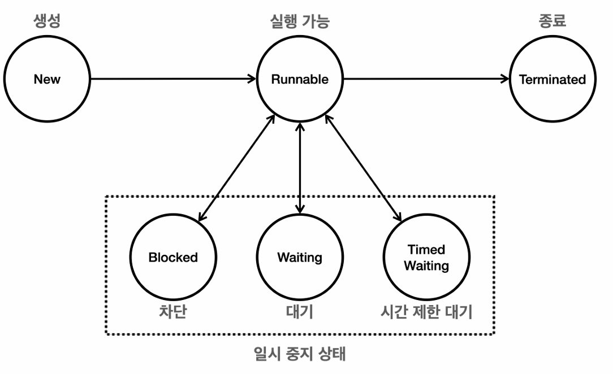

스레드 제어 및 생명주기
==
## 스레드의 정보 

1. 스레드 생성
   - 스레드를 생성할 때, Runnable 구현체와 스레드 이름을 전달할 수 있다.
   - 스레드 이름은 디버깅, 로깅 목적으로 유용하다.
2. 스레드 객체 정보
   - Thread[#1,main,5,main]
   - 각각 스레드 ID, 이름, 우선순위, 스레드 그룹을 포함한다.
3. 스레드 ID
   - threadId()
   - 스레드의 고유 식별자를 반환하는 메서드
   - JVM 내에서 각 스레드에 대해 유일하고 직접 지정할 수 없는 값.
4. 스레드 이름
   - 스레드 이름은 중복 가능하다.
5. 스레드 우선순위
   - 1 ~ 10의 우선 순위를 가질 수 있다.
   - 높을 수록, 더 많이 스케쥴러에 의해 할당될 가능성이 높다.
6. 스레드 그룹
   - getThreadGroup()
   - 스레드가 속한 스레드 그룹을 반환하는 메서드.
   - 스레드 그룹은 여러 스레드를 하나의 그룹으로 묶어서 작업을 수행할 수 있다.
   - 새로운 스레드를 생성하는 스레드를 **부모 스레드**라고 한다.
   - 잘 사용되지는 않는다.
7. 스레드 상태
   - getState()
   - 스레드의 현재 상태를 반환하는 메서드이다.
   - 다음과 같은 상태가 존재한다.
     - NEW : 스레드가 시작되지 않은 상태이다.
     - RUNNABLE : 스레드가 실행 중이거나 실행될 준비가 된 상태
     - BLOCKED : 스레드가 동기화 락을 기다리고 있는 중이다.
     - WAITING : 스레드가 다른 스레드의 특정 작업이 완료되기를 기다리는 상태.
     - TIMED_WAITING : 일정 시간 동안 기다리는 상태.
     - TERMINATED : 스레드가 실행을 마친 상태.


## 스레드 생명 주기

**스레드의 상태**

- NEW : 스레드가 시작되지 않은 상태이다.
- RUNNABLE : 스레드가 실행 중이거나 실행될 준비가 된 상태
- 일시적으로 중단된 상태(Suspended States)
  - BLOCKED : 스레드가 동기화 락을 기다리고 있는 중이다.
  - WAITING : 스레드가 다른 스레드의 특정 작업이 완료되기를 기다리는 상태.
  - TIMED_WAITING : 일정 시간 동안 기다리는 상태.
- TERMINATED : 스레드가 실행을 마친 상태.

1. NEW(새롭게 스레드 객체가 생성된 상태)
   - 스레드가 생성되고 아직 실행이 되지 않은 상태.
   - start() 메서드 호출 이전 상태를 말한다.
2. RUNNABLE(실행 가능 상태)
   - 스레드가 실행될 준비가 된 상태.
   - start() 메서드가 호출되면 이 상태로 들어간다.
   - 실제 CPU에 할당되어 실행되고 있거나 스케쥴링에 대기하고 있는 상태일 경우 해당 상태이다.
   - 이 상태에 있는 경우만 CPU에 할당되어 실행 가능하다.
3. BLOCKED(차단 상태)
   - 스레드가 다른 스레드에 의해 동기화 락을 얻기 위해 기다리는 상태.
4. WAITING(대기 상태)
   - 스레드가 다른 스레드의 특정 작업이 완료되기를 무기한 기다리는 상태.
   - wait(), join() 메서드가 호출될 때 이 상태가 된다.
   - 다른 스레드가 notify(), notifyAll() 메서드를 호출하거나 join()이 완료될 때 까지 대기.
5. TIMED_WAITING(시간 제한 대기 상태)
   - sleep(long millis), wait(long timeout), join(long millis)
   - 주어진 시간이 경과하거나 다른 스레드에 의해 깨어나면 이 상태에서 벗어난다.
6. TERMINATED(종료 상태)
   - 작업이 모두 완료되어 스레드가 종료된 상태.
   - 한번 종료되면 다시 시작할 수 없다.

## 체크 예외 재정의
Runnable 인터페이스는 run 메서드 하나만 가지고 있다.

**체크 예외**
- 인터페이스을 구현한 클래스는 하위 예외 계층를 던질 수 있다.
- 부모 메서드가 체크 예외를 던지지 않으면 서브 클래스에서 체크 예외를 던질 수 없다.
- 예외 처리가 강제된다.

**언체크 예외**
- 예외 처리를 강제하지 않기 때문에 던질 수 있다.

체크 예외를 던지는 메서드를 호출할 때 반드시 예외 처리 하도록 강제하는 것으로 프로그램이 비정상 종료되는 것을 방지할 수 있다.

멀티스레드 환경에서 적절한 예외 처리가 이뤄지지 않으면 무슨 일이 일어날지 예상할 수 없다.

## join

#### join이 필요한 상황
- 하나의 CPU 코어를 사용하는 것이 아닌 여러 개의 CPU를 사용해서 연산 시 빠른 연산 수행이 가능할 것.
- 여러 개의 스레드를 만들어서 하나의 작업을 분할하여 그 결과를 합치면 더욱 빠른 연산 가능.
- ex) 1~100 을 합하는 연산. 스레드 A 1~50, 스레드 B 51~100

```java
public class JoinMainV1 {

    public static void main(String[] args) {
        log("Start");

        SumTask task1 = new SumTask(1, 50);
        SumTask task2 = new SumTask(51, 100);

        Thread t1 = new Thread(task1, "thread-1");
        Thread t2 = new Thread(task2, "thread-2");

        t1.start();
        t2.start();

        try {
            t1.join();
            t2.join();
        } catch (InterruptedException e) {
            throw new RuntimeException(e);
        }

        log("task1.result = " + task1.result);
        log("task2.result = " + task2.result);

        int sumAll = task1.result + task2.result;
        log("sumAll = " + sumAll);
        log("End");
    }
}
```
- join을 호출하지 않으면
  - main, thread1, thread2 세 개의 스레드가 동시에 실행 중이다.
  - main 스레드에서 작업이 끝나지 않은 thread1, thread2의 연산 결과를 조회하고자 한다.
  - sumAll의 결과는 0이 조회가 되고 예상과 달리 실패한다.
- join 호출 시
  - 현재 실행 중인 스레드를 join 대상 스레드의 작업이 종료될 때 까지 WAITING 상태로 만든다.
  - 이 덕분에 t1, t2 스레드가 작업을 마무리할 때까지 main 스레드를 WAITING 상태로 만들 수 있다.

하지만, join은 해당 스레드가 종료될 때까지 대상 스레드가 대기한다는 것이 문제가 될 수 있다.
- 오버로딩되어 있는 join(long timeout)을 호출하여 무기한 대기하는 것이 아닌 특정 시간 동안만 TIMED_WAITING 상태로 만들 수 있다.

#### this
각 스레드마다 한 개씩 스택을 소유한다.

메서드를 호출할 때마다 스택 프레임이 생성되는데 

스레드는 스케쥴러에 의해 컨택스트 스위칭이 일어나며 실행하게 된다. 이때, 반드시 어떤 인스턴스의 메서드를 호출하고 있었는지 기억해야한다.

이를 위해 스택 프레임에 해당 인스턴스의 참조 값을 저장하는 this를 사용한다.


