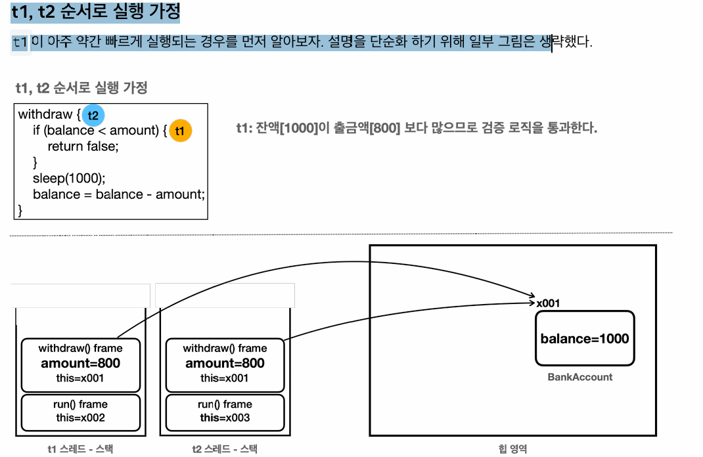

동시성 - Synchronized
==
멀티스레드를 사용할 때 가장 주의해야할 점은 같은 자원에 여러 스레드가 동시에 접근할 때 발생하는 동시성 문제이다.

이 때, 여러 스레드가 접근하는 자원을 **공유 자원**이라고 한다.

이런 공유 자원에 대해 동시성 문제를 발생하지 않도록 하기 위해서 사용하는 것이 **동기화 기법**이다.

```java
public class BankMain {
    public static void main(String[] args) throws InterruptedException {
        BankAccountV1 account = new BankAccountV1(1000);

        Thread t1 = new Thread(new WithdrawTask(account, 800), "t1");
        Thread t2 = new Thread(new WithdrawTask(account, 800), "t2");

        t1.start();
        t2.start();

        sleep(500);
        log("t1 state: " + t1.getState());
        log("t2 state: " + t2.getState());

        t1.join();
        t2.join();
        log("최종 잔액: " + account.getBalance());

    }
}

public class WithdrawTask implements Runnable {

    private final BankAccount account;
    private final int amount;

    public WithdrawTask(BankAccountV1 account, int amount) {
        this.amount = amount;
        this.account = account;
    }

    @Override
    public void run() {
        account.withdraw(amount);
    }
}

```
- 스레드 t1, t2는 account라는 자원을 서로 공유하고 있다.
  - 여기에서 account가 공유 자원이 된다.
- 동시에 t1, t2가 withdraw를 호출하고 검증 if 문을 통과하여 검증 문제가 발생한다.
- 결과 - 값을 가질 수 없는 account 인스턴스가 - 값을 갖게 된다.
- 동시에 같은 공유 자원에 값을 업데이트 때문에 발생하는 동시성 문제로 인해 발생한다.

## 동시성 문제


- t1, t2 스레드 모두 검증 로직을 통과하고 동시에 balance에 있는 값에 대한 수정을 할 때 동시성 문제를 피할 수 없다.
- 두 스레드가 동시에 실행하건 그렇진 않건 중요하지 않다.

원인은 함께 사용하는 공유 자원을 여러 단계로 나누어 사용하기 때문이다.
- 여러 스레드가 공유 자원을 사용하기 때문에 특정 시점에 유효했던 값이 수정이 되어 전혀 다른 값으로 계산될 수 있다.
- 공유 자원을 수정하는 로직이 존재할 경우, 해당 로직이 완료될 때 까지 하나의 스레드만 접근 가능하도록 설정해줄 필요가 있다.

**임계 영역**
- 여러 스레드가 동시에 접근하면 데이터 불일치나 예상치 못한 동작이 발생할 수 있는 중요한 코드 부분.
- 여러 스레드가 동시에 접근해서는 안되는 공유 자원을 접근하거나 수정하는 부분

즉, 임계 영역을 식별하고 그 구역을 하나의 스레드만 실행할 수 있도록 보장할 수 있는 방법이 필요하다.

## synchronized(동기화)
자바에서는 한 번에 하나의 스레드만 실행할 수 있는 코드 구간을 만들 수 있는 synchronized 키워드가 존재한다.

#### synchronized 메서드
- 메서드 앞에 synchronized 키워드만 붙이면 그 구역이 하나의 스레드만 실행할 수 있는 구역으로 설정된다.

#### synchronized 코드 블럭
- 메서드 전체를 synchronized로 설정하는 것이 아닌 실제 필요한 범위만 설정할 수 있다.
- synchronized 블럭을 사용하면 된다.
```java
    @Override
    public boolean withdraw(int amount) {
        log("거래 시작: " + getClass().getSimpleName());
        // 잔고가 출금액 보다 적으면, 진행하면 안됨

        // ==임계 영역 시작==
        synchronized (this) {
            log("[검증 시작] 출금액: " + amount + ", 잔액: " + balance);
            if (balance < amount) {
                log("[검증 실패] 출금액: " + amount + ", 잔액: " + balance);
                return false;
            }

            // 잔고가 출금액 보다 많으면, 진행
            log("[검증 완료] 출금액: " + amount + ", 잔액: " + balance);
            sleep(1000);
            balance -= amount;
            log("[출금 완료] 출금액: " + amount + ", 잔액: " + balance);
            // ==임계 영역 종료==
        }
        log("거래 종료");
        return false;
    }
```
- synchronized(instance address)
  - lock을 획득할 인스턴스를 지정한다.
  - this로 지정하면 현재 인스턴스의 lock을 획득한다는 의미이다.


#### synchronized 동작
1. 모든 객체의 내부에는 객체만의 Lock을 가지고 있다.
   - synchronized 키워드가 있는 메서드를 호출할 때, 스레드는 해당 객체의 lock을 반드시 가지고 있어야한다.
   - 이를 모니터 락이라고도 부른다. 
2. 먼저 호출한 스레드가 인스턴스의 lock을 가진다.
3. 그렇지 않은 다른 스레드들은 이때, lock을 반납할 때까지 대기하는 BLOCKED 상태가 된다.
   - BLOCKED 상태에 놓인 스레드는 스케쥴러 대상이 아니다.
4. 다른 스레드가 메서드 호출이 종료된 이후 lock을 반납하면 이때 BLOCKED 상태에 있는 스레드가 LOCK을 획득하고 RUNNABLE 상태가 된다.

동기화는 여러 스레드가 동시에 접근할 수 있는 자원에 대해 일관성 있고 안전한 접근을 보장하기 위한 메커니즘이다.
- 주로 멀티스레드 환경에서 발생할 수 있는 문제를 방지하기 위해 사용한다.
- race condition을 해결하고 데이터 일관성을 유지한다.


