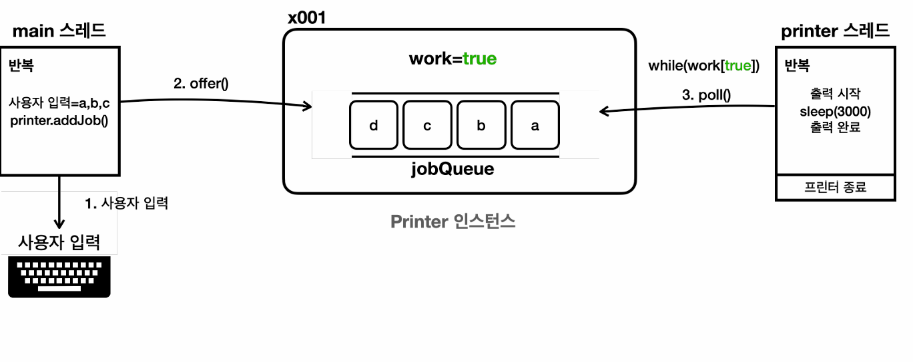
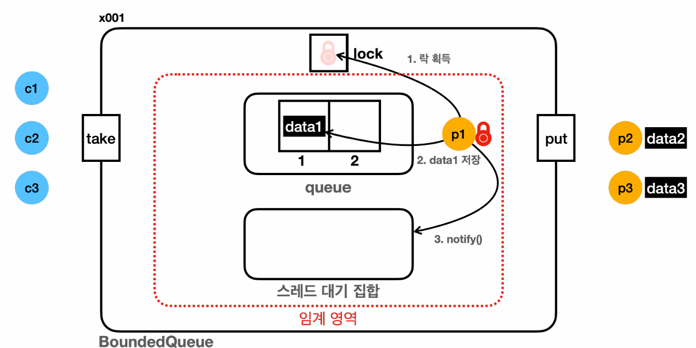
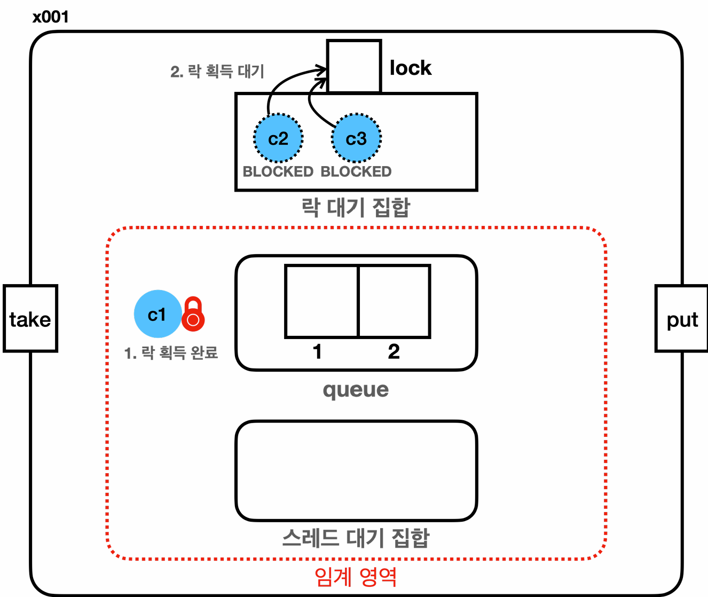
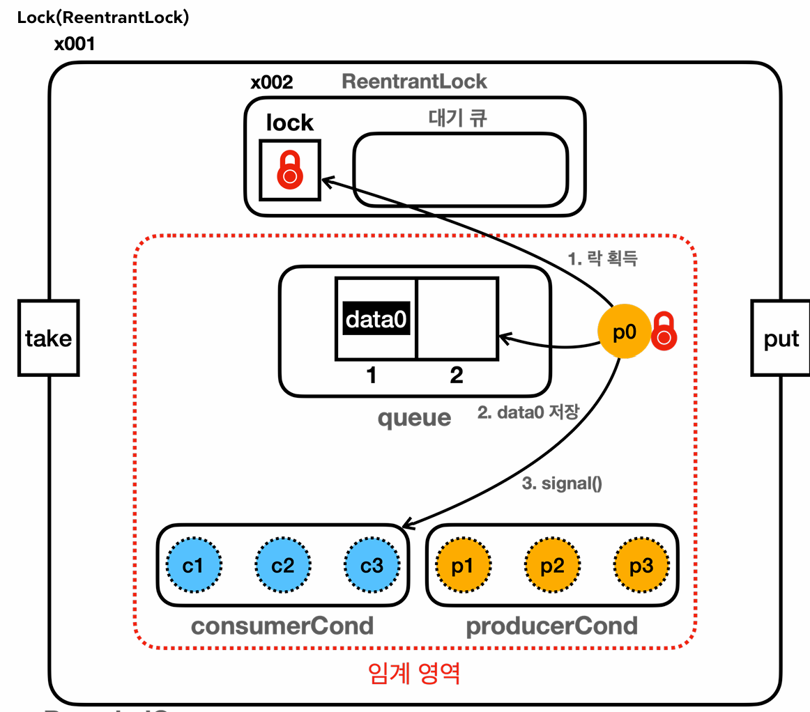
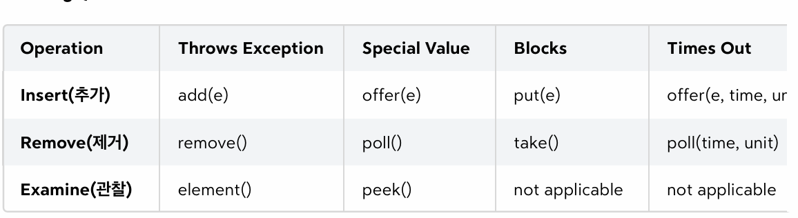

생산자, 소비자 문제
==
생산자 소비자 문제는 멀티스레드 프로그래밍에서 자주 등장하는 동시성 문제 중 하나이다.

여러 스레드가 동시에 데이터를 생산하고 소비하는 상황을 다루는 문제이다.



**기본 개념**
- **생산자(Producer):** 데이터를 생성하는 역할을 한다. 파일에서 데이터를 읽어오거나 네트워크에서 데이터를 받아오는 스레드가 생산자 역할을 할 수 있다. 
- **소비자(Consumer):** 생성된 데이터를 사용하는 역할을 한다. 예를 들어, 데이터를 처리하거나 저장하는 스레드가 소비자 역할을 수행할 수 있다.
- **버퍼(Buffer):** 생산자가 생성한 데이터를 일시적으로 저장하는 공간. 한정된 크기를 갖고 생산자, 소비자가 이 버퍼를 통해 데이터를 주고 받는다.

문제는 다음과 같다.
- **생산자가 너무 빠를 때:** 버퍼가 가득 차서 더 이상 데이터를 넣을 수 없을 때 까지 생산자가 데이터를 생산한다. 결국 생산자는 버퍼가 빌 때까지 기다려야한다.
- **소비자가 너무 빠를 때:** 버퍼가 비어서 더 이상 소비할 데이터가 없을 때까지 소비자가 데이터를 처리한다.

이 문제는 다음 두 용어로 불린다.
- **생산자 소비자 문제:** 생산자 스레드와 소비자 스레드가 특정 자원을 함께 생산하고, 소비하면서 발생한 문제
- **한정된 버퍼 문제:** 중간에 있는 버퍼의 크기가 한정되어 있기 때문에 발생한다.

#### 생산자 우선 실행 시
생산자 스레드가 데이터를 계속 생성하고 소비자가 게속 소비했을 때 다음과 같은 문제가 발생한다.
- 생산자 스레드가 데이터를 계속 생산하다가 큐가 가득 차 더 이상 데이터를 넣을 수 없을 때 데이터의 손실이 일어날 수 있다.
  - 이를 방지 하기 위해 큐가 가득 찼을 때, 생산자 스레드가 빈 공간이 생길 때 까지 대기하는 것으로 데이터 손실을 방지할 수는 있다.
- 이후 소비자 스레드가 실행하면서 생산한 데이터를 소비한다. 이때도 큐가 비는 상황이 발생할 수 있다.
  - 큐가 빌 경우에 소비자 스레드도 마찬가지로 큐에 데이터가 들어오는 것을 주기적으로 확인하고 데이터를 소비할 수 있다.

스레드가 대기를 한다면, 손실되는 데이터가 하나도 없게 설계할 수 있을 것이다.

이것이 생산자 소비자 문제이다.

#### 소비자 우선 실행 시
- 생산된 데이터가 없기 때문에 모든 소비자 스레드가 데이터를 획득하지 못한다.
- 생산자가 데이터를 생산한다.  

**문제점**
- 생산자 스레드 먼저 실행하는 경우 데이터 손실이 일어나고 소비자 스레드는 데이터를 받지 못한다.
- 소비자 스레드 먼저 실행하는 경우 c1, c2, c3는 데이터를 받지 못하고 data3이 버려진다.

이 문제를 개선하기 위해 아래와 같이 코드를 개선한다.

```java
public class BoundedQueueV2 implements BoundedQueue {

    private final Queue<String> queue = new ArrayDeque<>();
    private final int max;

    public BoundedQueueV2(int max) {
        this.max = max;
    }

    @Override
    public synchronized void put(String data) {
        while (queue.size() == max) {
            log("[put] 큐가 가득참, 생산자 대기.");
            sleep(100);
        }

        queue.offer(data);
    }

    @Override
    public synchronized String take() {
        while (queue.isEmpty()) {
            log("[take] 큐에 데이터가 없음, 소비자 대기");
            sleep(100);
        }

        return queue.poll();
    }

    @Override
    public String toString() {
        return queue.toString();
    }
}
```
**무한정 대기**

데이터 손실 문제를 해소하기 위해 코드를 개선했지만 다음과 같은 문제가 발생한다.
- 큐가 가득 찼을 때 생산자 스레드가 락을 가지고 무한정 대기에 빠진다.
- 이로 인해, 소비자 스레드는 임계 영역으로 접근하지 못한다.
- 락을 반납하려면 소비자 스레드가 진입해야하는데, 락을 가지고 무한정 대기하는 상태에 빠지기 때문에 모든 스레드가 lock을 대기하는 BLOCKED 상태에 빠진다.
- 소비자 스레드를 우선적으로 실행하든 생산자 스레드를 우선적으로 실행하든 상관없이 한 스레드를 제외하고 모든 스레드가 BLOCKED 상태가 된다.

이와 같은 **무한 대기 문제**를 해소하기 위한 방안이 존재한다.

반드시 멀티스레드 환경에서 lock을 선점한 채 무한정 대기상태에 빠지면 안된다.

### 정리
버퍼가 비었을 때 소비하거나, 버퍼가 가득 차있을 때 생산하는 문제를 해결하기 우해 락을 가지고 임계 영역안에서 대기하는 것이 문제이다.

그래서, 다른 스레드가 임계 영역안에 접근 조차할 수 없게 된다.

락을 가지고 있다가 다른 스레드에게 락을 양보할 수 있다면 이 문제를 쉽게 해결할 수 있다.

## wait, notify
임계 영역안에서 락을 가지고 무한 대기하는 문제를 해결하기 위해 Object 클래스의 notify, wait 메서드가 존재한다.
- Object.wait()
  - 락을 가지고 있는 상태에서만 호출할 수 있다. 
  - 현재 스레드가 가진 락을 반납하고 대기한다(WAITING)
  - 현재 스레드를 대기 상태로 전환한다. 이 메서드는 다른 스레드가 notify(), nofityAll()을 호출할 때까지 대기 상태를 유지한다.
- Object.notify()
  - synchronized 블록이나 메서드 안에서 호출할 수 있다.
  - 대기 중인 스레드를 하나 깨운다.
  - 만약 대기 중인 스레드가 여러 개이면, 그 중 하나만 깨운다.
- Object.notifyAll()
  - 대기 중인 모든 스레드를 깨운다.
  - 이 메서드도 synchronized 블록이나 메서드에서 호출되어야한다.

#### 스레드 대기 집합 (wait set)


- synchronized 임계 영역 안에서 Object.wait()를 호출하면 스레드는 대기 상태에 들어간다. 대기 상태에 들어간 스레드를 관리하는 것을 **대기 집합**이라고 한다.
- 모든 객체는 대기 집합과 모니터 락을 갖는다.

#### 생산자 우선 - wait, notify 적용
- 생산자 스레드
  - 생산자 스레드가 데이터를 생산하기 시작할 때 큐에 데이터를 성공적으로 삽입했을 경우, WAIT 상태의 스레드를 깨우기 위해 notify()를 호출한다.
  - 큐가 가득 차 더 이상 생산할 데이터가 없을 때는 wait()를 호출하고 대기 집합에서 대기한다.
- 소비자 스레드 
  - 큐에 있는 데이터를 소비하고 소비를 했다는 것을 다른 스레드에 알리기 위해 notify()를 호출한다.
  - 큐가 비어 있을 경우에는 wait()를 호출하고 생산자 스레드가 데이터를 생산하는 것을 기다린다.

notify() 호출 시, 바로 코드를 실행하는 것이 아니라 LOCK을 획득할 때까지 대기하는 BLOCKED 상태에서 대기한다.

이후, 실행 스레드가 락을 반납하고 임계 영역을 벗어나면 


#### wait, notify 한계
wait, notify 방식은 스레드 대기 집합 하나에 모든 생산자, 소비자 스레드를 관리하기 때문에 

큐에 데이터가 없는 상황에서 소비자가 같은 소비자를 깨우는 비효율이 발생할 수 있고 생산자가 같은 생산자를 깨우는 비효율도 발생한다.

**같은 종류의 스레드를 깨울 때 비효율이 발생한다.** 
- 생산자가 소비자를 깨우고 소비자가 생산자를 깨운다면 이 문제를 해결할 수 있다.

#### 스레드 기아(thread starvation)
- notify()는 대기 집합에 있는 스레드를 대기 상태에 놓인 스레드가 실행 순서를 계속 얻지 못해서 실행되지 못하는 기아 상태에 놓일 수 있다.

즉, notify, wait 방식으로는 비효율과 스레드 기아현상을 모두 해결할 수 없다.

## Lock Condition

생산자가 생산자를 깨우고, 소비자가 소비자를 깨우는 비효율 문제를 해결하기 위해 synchronized 키워드가 아닌 Lock, ReentrantLock을 활용한다.
```java
public class BoundedQueueV4 implements BoundedQueue {

    private final Queue<String> queue = new ArrayDeque<>();
    private final int max;

    private final Lock lock = new ReentrantLock();
    private final Condition condition = lock.newCondition();

    public BoundedQueueV4(int max) {
        this.max = max;
    }

    @Override
    public void put(String data) {
        lock.lock();
        try {
            while (queue.size() == max) {
                log("[put] 큐가 가득참, 생산자 대기.");
                try {
                    condition.await();
                    log("[put] 생산자 깨어남.");
                } catch (InterruptedException e) {
                    throw new RuntimeException(e);
                }
            }

            queue.offer(data);
            log("[put] 생산자 데이터 저장, notify() 호출");
            condition.signal(); // 대기 스레드, WAIT -> BLOCKED
        } finally {
            lock.unlock();
        }
    }

    @Override
    public String take() {
        lock.lock();
        try {
            while (queue.isEmpty()) {
                log("[take] 큐에 데이터가 없음, 소비자 대기");
                try {
                    condition.await(); //  -> RUNNABLE
                    log("[take] 소비자 깨어남");
                } catch (InterruptedException e) {
                    throw new RuntimeException(e);
                }
            }
            String data = queue.poll();
            log("[take] 소비자 데이터 획득, notify() 호출");
            condition.signal(); // WAIT -> RUNNABLE
            return data;
        } finally {
            lock.unlock();
        }
    }

    @Override
    public String toString() {
        return queue.toString();
    }
}
```
- **Condition**
  - Condition은 ReentrantLock을 사용하는 스레드가 대기하는 스레드 대기공간이다.
  - 모든 객체 인스턴스가 가지
  - await()
    - wait()와 유사한 기능을 수행한다.
    - condition에 현재 스레드를 대기 상태로 보관한다.
  - signal()
    - notify()와 유사한 기능을 수행한다. 
    - condition에서 대기하는 스레드를 깨운다.

ReentrantLock 을 사용할 경우, 인스턴스에 존재하는 스레드 대기 공간을 사용하는 것이 아니라는 점이 다르다.
- 스레드 비효율 문제와 기아 현상을 막을 수는 없다.
- 이를 해결하기 위해 생산자, 소비자 스레드 대기 공간을 별도로 만들어야한다.

## 생산자 소비자 스레드 대기 공간 분리

#### Object.notify vs Condition.signal
- Object.notify()
  - 대기 중인 스레드 중 임의의 하나를 선택해서 깨운다.
  - 스레드가 깨어나는 순서는 정의되어 있지 않고 JVM 구현에 따라 다르다.
  - 모니터 락을 가지고 있는 스레드가 호출해야한다.
- Condition.signal()
  - 대기 중인 스레드 중 하나를 깨운다.
  - Condition은 Queue 구조를 사용하기에 FIFO 순서로 깨운다.
  - ReentrantLock을 가지고 있는 스레드가 호출해야한다.

## 스레드 대기
synchronized, ReentrantLock의 대기 상태는 2가지 단계의 대기 상태가 존재한다.

### synchronized 대기
- 대기1: 락 획득 대기
  - BLOCKED 상태로 락 대기
  - synchronized를 시작할 때 락이 없으면 대기
  - 다른 스레드가 synchronized 블럭을 벗어나면서 대기가 풀리고 락 획득을 시도.
- 대기2: wait()로 인한 대기
  - WAITING 상태에서 대기한다.
  - wait()를 호출하면 락을 반납하고 스레드 대기 집합에서 대기한다.
  - 다른 스레드가 notify()를 호출해야 벗어날 수 있다.

#### 락 대기 집합

- BLOCKED 상태에 있는 스레드가 모니터 락을 획득하기 위해서 대기하는 공간에서 관리된다.
- WAITING 상태에 있는 스레드는 스레드 대기 집합에서 대기한다.

BLOCKED 상태의 경우 락을 획득하기 위한 대기 장소에서 대기하게 되고, 더 이상 실행할 수 없는 경우 락을 반납하고 대기하는 스레드 대기 집합에서 대기한다. 

그래서 다음과 같이 수행된다.
1. 특정 스레드가 더 이상 작업을 수행할 수 없을 때 wait() 호출을 통해 락을 반납하고 스레드 대기 집합에서 대기한다.
2. 다른 스레드에 의해 notify()가 호출됐을 때 즉, 통해 추가적인 작업을 수행할 수 있는 상황이 되었을 때 대기 집합에서 깨어난다.
3. 만약 이 경우에 락을 획득할 수 없는 경우에 락 대기 집합에서 락을 획득할 때 까지 대기한다.
4. 다른 스레드가 락을 반납하는 경우 락 대기 집합에 있는 스레드 중 하나가 락을 획득하고 안전한 임계 영역안에 있는 코드를 실행한다.

### ReentrantLock 대기

- 대기1: ReentrantLock 대기 락 획득 대기
  - WAITING 상태로 락 획득 대기
  - lock.lock()을 호출했을 때, 락이 없으면 대기.
- 대기2: await() 대기
  - condition.await() 호출 시condition 객체의 스레드 대기공간에서 관리한다. 
  - WAITING 상태로 대기.
  - condition.signal() 호출을 통해 condition 객체의 스레드 대기 공간에서 빠져나간다.
  - synchronized 블럭에서 락 대기 집합에서 락 획득을 대기하는 것 처럼 동작한다.

## BlockingQueue
생산자 소비자 문제를 해결하기 위해 특별한 멀티스레드 자료 구조를 제공한다.

큐가 특정 조건을 만족할 때까지 스레드의 작업을 차단한다.
- **데이터 추가 차단:** 큐가 가득 차면 데이터 추가 작업을 시도하는 스레드는 공간이 생길 때까지 차단된다.
- **데이터 획득 차단:** 큐가 비어 있으면 획득 작업을 시도하는 스레드는 큐에 데이터가 들어올 때까지 차단된다.

**구현체**
- ArrayBlockingQueue
- LinkedBlockingQueue

#### 기능
멀티스레드를 사용할 때는 응답성이 중요하다. 예를 들어 대기 상태에 있어도, 고객이 중지 요청을 하거나, 또는 너무 오래 대기한 경우 포기하고 빠져나갈 수 있는 방법이 필요하다.

생산자가 데이터를 생산하는데 버퍼가 너무 오래 대기해야하면, 무한정 기다리는 것이 아닌 작업을 포기하는 것이 더 나은 선택일 수 있다.

큐의 한계가 1000개라 가정할 때, 생산자 스레드가 순간적으로 1000개 넘는 주문을 큐에 담고 소비자 스레드가 10개 정도의 주문만 처리할 수 있을 경우 소비가 생산을 따라가지 못하고 큐기 가득찰 수 있다.

이 경우 수 많은 생산자 스레드가 큐 앞에서 대기하게 된다. 고객도 응답을 받지 못하고 무한 대기하는 상황에 빠지게 될 것이다.

이렇게 생산자 스레드가 큐에 데이터를 추가할 때 큐가 가득 찬 경우, 또는 큐에 데이터를 추가하기 위해 너무 오래 대기한 경우에는 데이터 추가를 포기하고, 요청을 처리할 수 없다거나 다시 시도해 달라고 하는 것이 더 나은 선택이다.

큐가 가득 찼을 경우 4가지 선택지가 있다.
- 예외를 던진다. 예외를 받아서 처리한다.
- 대기하지 않는다. false를 반환한다.
- 대기한다.
- 일정 시간만큼 대기한다.

BlockingQueue는 각 상황에 맞는 다양한 메서드를 제공한다.



- Throws Exception - 대기시 예외
  - **add(e):** 지정된 요소를 큐에 추가한다. 큐가 가득 차면 IlleagalStateException 예외를 던진다.
  - **remove():** 큐에서 요소를 제거한다. 큐가 비어 있으면 NoSuchElementException 예외를 던진다.
  - **element():** 큐의 머리 요서를 반환하지만, 요소를 큐에서 제거하지 않는다 비어 있으면 NoSuchElementException 예외를 던진다.
- Special Value - 대기시 즉시 반환
  - **offer(e):** 지정된 요소를 큐에 추가하려고 시도한다. 큐가 가득 차면 false를 반환한다.
  - **poll():** 큐에서 요소를 제거하고 반환한다. 큐가 비어 있으면 null을 반환한다.
  - **peek():** 큐의 머리 요소를 반환하지만, 요소를 큐에서 제거하지 않는다. 큐가 비어 있으면 null 반환.
- Blocks - 대기
  - **put(e):** 지정된 요소를 큐에 추가할 때까지 대기한다.
  - **take():** 큐에서 요소를 제거한다. 큐가 비어있으면 요소가 준비될 때까지 대기한다. 
- Times out - 시간 대기
  - **offer(e, time, unit):** 지정된 요소를 큐에 추가하려고 시도한다.
  - **poll(time, unit):** 큐에서 요소를 제거하고 반환한다.
