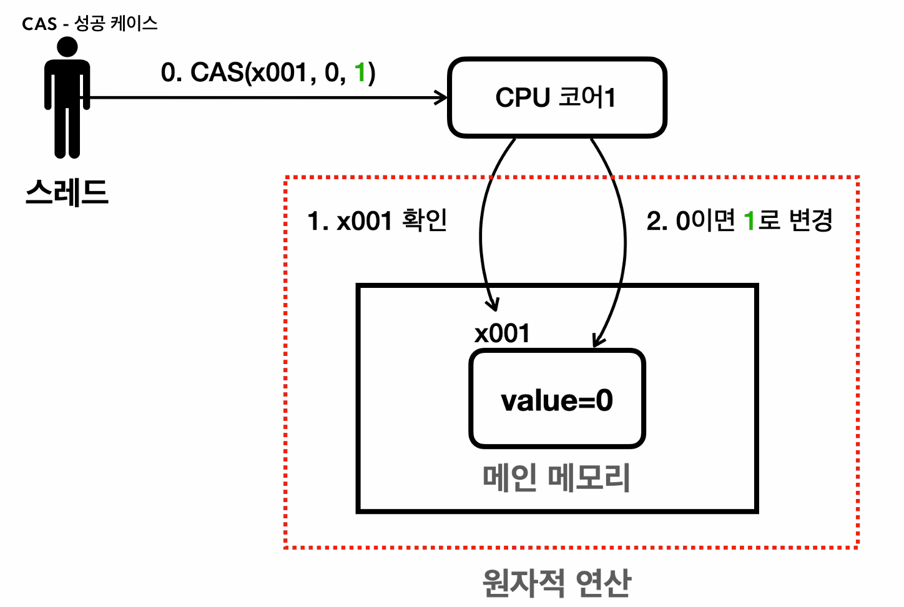

원자적 연산 (Compare And Swap)
==
## 원자적 연산(atomic operation)** 
원자적 연산은 해당 연산이 더 이상 나눌 수 없는 단위로 수행된다는 것을 의미한다.

예를 들어, i = 1 의 경우 단순히 i라는 변수에 1을 저장하는 더 이상 쪼갤 수 없는 **원자적 연산**이다.

반면, i = i + 1은 (1)i의 값을 읽고 (2)그 값에 1을 더한 값을 (3)i라는 변수에 저장한다. 단계적으로 3단계를 거쳐 수행되기 때문에 원자적 연산이 아니다.

멀티스레드 환경에서 원자적이지 않은 연산을 수행하면 동시성 문제가 발생한다.

#### AtomicInteger, AtomicXXX
- 멀티스레드 상황에서 안전하게 증가 연산을 수행할 수 있는 클래스를 제공한다.
- Atomicxxx 클래스를 사용하면 멀티스레드 상황에서 안전하게 사용할 수 있다.
- Lock을 사용하지 않고 원자적 연산을 만들어내서 성능이 synchronized, Lock을 사용하는 것보다 1.5 ~ 2배가량 빠르다.

## CAS(Compare And Swap)

### 락 기반 방식의 문제점
데이터를 보호하기 위해 락을 사용하면 스레드가 해당 자원에 접근하는 것을 제한한다.
락이 해제될 때까지 다른 스레드가 접근할 수 없고 락이 해제될 때까지 대기해야한다.

락을 사용하는 방식은 직관적이지만 상대적으로 무거운 작업이다.

락 기반 방식의 문제를 해결하기 위해 락을 사용하지 않고 원자적인 연산을 수행할 수 있는 **CAS(Compare and swap) 연산**을 사용한다.
말 그대로 값을 비교하고 맞으면 새로운 값을 대입하고 아니라면 유지하는 연산이다. 

다른 이름으로 락을 사용하지 않기 때문에 락 프리(lock-free) 기법이라고 한다.

**CAS 연산**

- 원자적이지 않은 연산을 CPU 하드웨어 차원에서 하나의 원자적인 연산으로 묶어서 제공하는 기능이 바로 CAS 연산이다.
- 값을 확인하고 변경하는 작업을 하나의 원자적인 단위로 만든다.

```java
i = i + 1;
```
- 위 연산은 원자적 연산이 아니다.
- Atomicxxx 클래스의 incrementAndGet 메서드는 CAS 연산을 이용해 연산을 수행한다.

#### 정리

CAS를 사용하면 락을 사용하지 않지만, 다른 스레드가 값을 증가해서 문제가 발생하면 루프를 돌며 재시도하는 방식을 사용한다.
다음과 같다.
1. 현재 변수의 값을 읽어온다.
2. 변수의 값을 1 증가시킬 때, 원래 값이 같은지 확인한다.
3. 동일하다면 증가된 값을 저장하고 그렇지 않다면 다시 처음으로 돌아가 1-3 과정을 다시 수행한다.

**장점**
- 락을 사용하지 않기 때문에 높은 성능을 발휘한다.
  - 이로 인해 락 획득을 위한 대기 시간과 오버헤드가 줄어드는 장점을 가진다.

**단점**
- 루프를 계속 돌기 때문에 CPU 자원을 많이 소모된다.
  - 스레드간 충돌 발생할 경우가 없다면, CAS 사용이 적합.

### Lock vs CAS
- **Lock**
  - 비관적(pessimistic) 접근법
  - 데이터에 접근하기 전에 항상 락을 획득
  - 다른 스레드의 접근을 막는다.
  - 다른 스레드가 무조건 방해할 것이라는 전제가 깔려있다.
  - 스레드를 락 획득한 순서대로 하나씩 수행한다.
- **CAS(Compare And Swap)**
  - 낙관적(optimistic) 접근법.
  - 락을 사용하지 않고 데이터에 바로 접근.
  - 충돌이 발생하면 그때 재시도.
  - 대부분 충돌이 없을 것이라 가정.
  - 스레드 충돌 발생한 경우만 재시도한다.
  - 간단한 CPU 연산 사용에 적합하다.

## CAS 락
CAS는 락을 구현하는데 사용이 가능하다.
```java
public class SpinLockBad {

    private volatile boolean lock = false;

    public void lock() {
        log("락 획득 시도");
        while (true) { 
            // 여러 스레드 중 하나의 스레드만 락을 획득할 수 있다.

            // 1. 락 사용여부 확인
            // false인 경우 lock을 사용하고 있지 않다.
            // true인 경우 lock을 사용하고 있다.
            if (!lock) { // 원자적 연산이 아님. 값을 확인하고
                sleep(100);
                lock = true; // 2. 락의 값 변경 값을 변경
                break;
            } else {
                // 락을 획득할 때 까지 스핀 대기한다.
                log("락 획득 실패 - 스핀 대기");
            }
        }
        log("락 획득 완료");
    }

    public void unlock() {
        lock = false;
        log("락 반납 완료");
    }
}
```
- 동시에 여러 스레드가 동시성 문제로 인해 여러 스레드가 락을 획득한다.
- synchronized 블럭이나 Lock을 이용해 Lock을 걸어서 동기화를 해줘야한다.
- 값을 확인하고, 값을 변경하는 로직이 원자적이지 않기 때문에 동시성 문제가 발생한다.
  - CAS 연산을 활용해서 이를 원자적으로 만들면 문제를 해결할 수 있다.

**CAS 단점**
- 락을 기다리는 스레드가 BLOCKED, WAITING 상태로 빠지지 않고 RUNNABLE 상태로 while문을 계속 반복한다. 
  - CPU를 계속해서 사용한다.
  - 이를 busy waiting(락을 획득할 때까지 RUNNING 상태로 락 획득 대기.) 이라고 한다.

이런 단점이 존재하기 때문에 CAS는 임계 영역안의 작업이 아주 짧은 CPU 연산 시간을 사용할 때 사용해야한다.

## 정리

### 락 vs CAS 사용 방식

**CAS의 장점**
1. **낙관적 동기화:** 락을 걸지 않고도 값을 안전하게 업데이트할 수 있다.
2. **락 프리(Lock-Free):** CAS는 락을 사용하지 않기 때문에, 락을 획득하기 위해 대기하는 시간이 없다. 따라서 스레드가 블로킹 되지 않는다. 병렬 처리가 더 효율적일 수 있다.

**CAS의 단점**
1. **충돌이 빈번한 경우:** 여러 스레드가 동시에 동일한 변수에 접근하여 업데이트를 시도할 때 충돌이 발생한다. CAS는 충돌이 발생 시 충돌 발생 횟수 만큼 루프를 반복해야하므로 오버헤드가 발생한다.
2. **스핀락과 유사한 오버헤드:** 충돌 발생 시 반복적인 재시도로 인해 성능 저하가 발생한다.

**동기화 락 장점**
1. **충돌 관리:** 락을 사용하면 하나의 스레드만 리소스에 접근할 수 있어 충돌이 발생하지 않는다.
2. **안정성:** 복잡한 상황에서도 락은 일관성 있는 동작을 보장
3. **스레드 대기:** 대기상태에 놓인 스레드는 CPU를 거의 사용하지 않는다.

**동기화 락 단점**
1. **락 획득 시간:** 스레드가 락을 획득하기 위해 대기해야 하므로, 대기 시간이 길어진다.
2. **컨텍스트 스위칭 오버헤드:** 락을 사용하면, 락 획득 대기 시점과 락을 획득하는 시점에 스레드 상태가 변경된다. 이때 컨텍스트 스위칭이 발생할 수 있어 오버헤드가 발생한다.

일반적으로는 동기화 락을 사용하고 특정 상황에서만 CAS을 사용하자.
