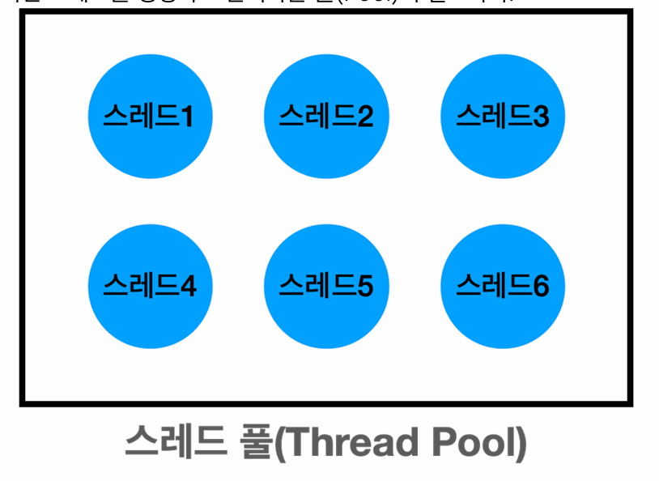
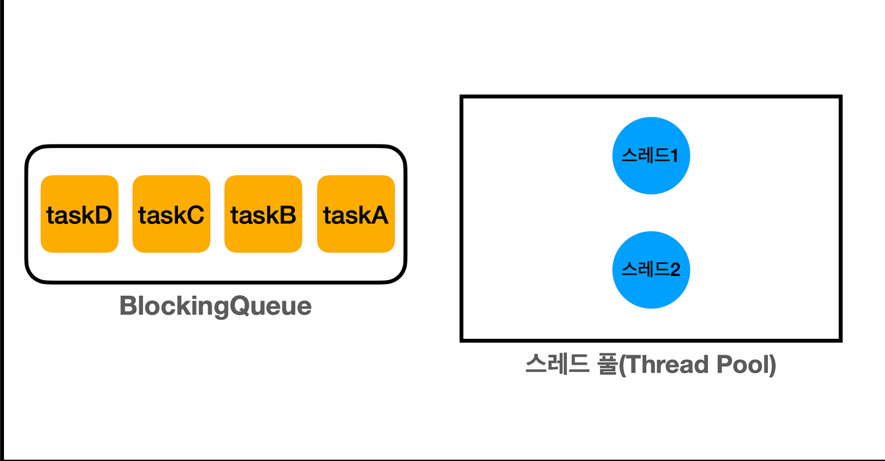
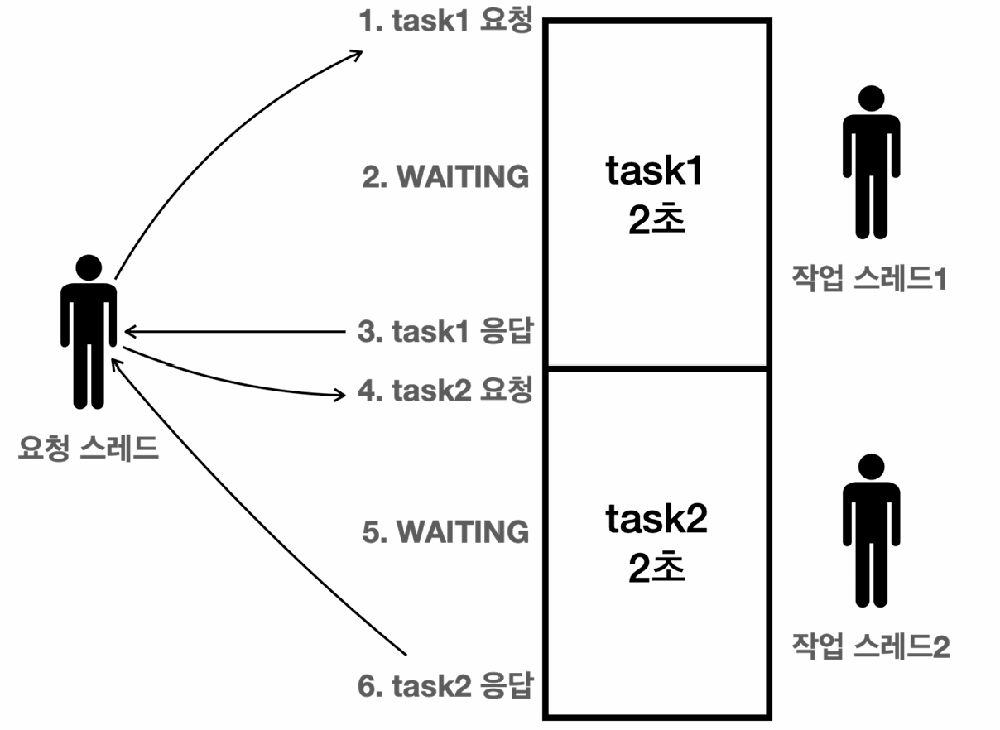
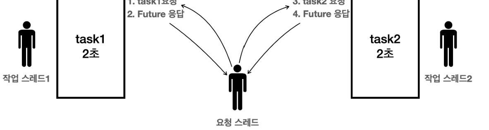
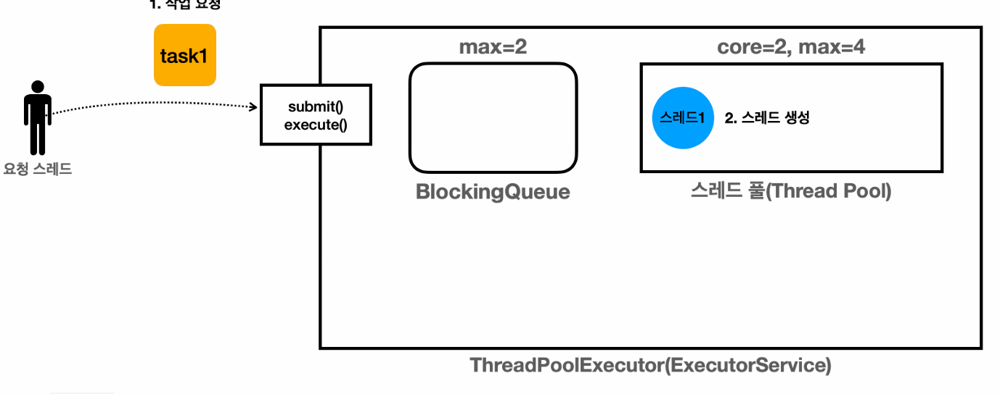
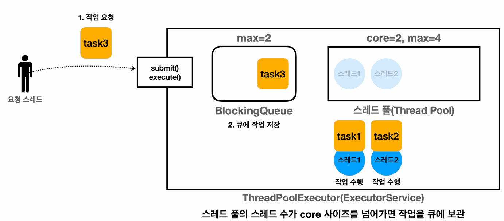
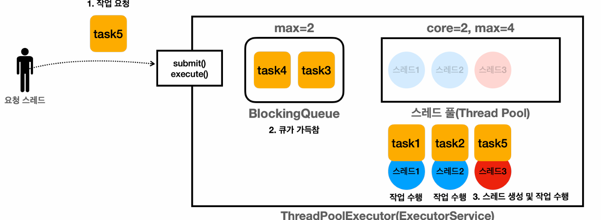

스레드 풀, Executor
==

## 스레드를 직접 사용할 때 문제점
### 스레드 생성 시간으로 인한 성능 문제
스레드를 사용하려면 스레드를 생성해야 한다. 스레드는 다음과 같은 이유로 매우 무겁다.
- **메모리 할당:** 각 스레드는 자신만의 call stack을 가지고 있어야한다. 운영체제 입장에서 별도의 메모리 공간을 생성해야한다. 
- **운영체제 자원 사용:** 스레드를 생성하는 작업을 운영체제 커널 수준에서 이뤄진다. system call을 통해 처리된다.
- **운영체제 스케줄러 설정:** 새로운 스레드가 생성되면 운영체제의 스케줄러는 이 스레드를 관리하고 실행 순서를 조정해야한다. 운영체제의 스케줄링 알고리즘에 따라 오버헤드가 발생할 수 있다.

### 스레드 관리 문제
서버의 자원(CPU, 메모리)은 한정적이기 때문에, 무한하게 스레드를 만들 수 없다.

우리 시스템이 버틸 수 있는, 최대 스레드 수 까지만 스레드를 생성할 수 있도록 관리를 해야한다.

### Runnable 인터페이스 불편함
- **반환 값이 없다:** run() 메서드가 반환 값을 가지지 않기 때문에 스레드가 종료되길 기다린 이후 멤버 변수에 보관한 값을 받아야한다.
- **예외 처리:** 체크 예외를 던질 수 없기 때문에 메서드 내부에서 처리해야한다.

스레드 관리 및 생성 문제를 해결하기 위해서는 미리 스레드를 생성하여 관리하는 풀이 필요하다. 이를 **스레드 풀**이라고 한다.



- 스레드를 관리하는 풀에 필요한 만큼 만들고 스레드는 이 공간에서 대기한다.
- 작업 요청이 오면 폴에 존재하는 작업 요청처리가 가능한 스레드 중 하나가 조회되고 작업을 처리한다.
- 작업이 완료된 스레드는 스레드 폴에 반납하고 이후 재사용될 수 있다.

자바에서는 Executor 프레임워크로 스레드 폴, 스레드 관리, Runnable의 문제점과 생산자 소비자 문제까지 해결해주는 최고의 멀티스레드 도구이다.

## Executor 프레임워크
```java
public interface Executor {
    void execute(Runnable command);
}


public interface ExecutorService extends Executor, AutoCloseable {
    <T> Future<T> submit(Callable<T> task);
    
    @Override
    default void close(){...}
    ...
}
```
- Executor 인터페이스
  - 가장 단순한 실행 인터페이스
- ExecutorService 인터페이스
  - Executor 인터페  이스 확장
  - submit, close 같은 주요 메서드가 존재.

### ThreadPoolExecutor

- ThreadPollExecutor 는 작업을 보관하는 BlockingQueue와 스레드를 관리하는 스레드 풀로 구성되어있다.
- 스레드 풀에 있는 스레드가 소비자, Executor 밖에서 작업을 추가하는 스레드가 생산자 스레드이다.
- 스레드 풀은 스레드를 미리 만들어두지는 않고 최초의 작업이 들어올 때 스레드를 생성하고 corePoolSize 크기까지 스레드를 만든다.
- 작업이 모두 처리되면 스레드는 스레드 풀에 보관된다.

### Runnable 불편함
Runnable 인터페이스는 다음과 같은 불편함이 있다.
- **반환 값 없음:** 메서드가 반환 값을 갖지 않기 때문에 불편하게 join() 메서드를 통해 작업 스레드가 종료될 때까지 대기한 이후 결과 값을 조회하는 별도의 작업을 수행해야한다.
- **예외 처리:** 체크 예외를 던질 수 없어 반드시 run 메서드 안에서 예외 처리를 수행해야한다.

이런 불편한 점을 해결하기 위해 요청 스레드가 작업에 대한 반환 값을 받을 수 있도록 Executor 프레임워크는 Callable, Future 인터페이스를 도입했다.

## Future

### Runnable, Callable
#### Runnable
```java
public interface Runnable {
    void run();
}
```
- Runnable은 체크 예외를 던질 수 없다.
- 반환 타입이 void 이기에 반환 값이 없다.

#### Callable
```java
public interface Callable<V> {
    V call() throws Exception;
}
```
- `java.util.concurrent`에서 제공된다.
- Callable은 제네릭 타입 V를 반환하기 때문에 Runnable과 달리 값을 반환할 수 있다.
- throws Exception이 선언되어 있어 예외도 던질 수 있다.

### Future 분석
```java
public class CallableMainV2 {

    public static void main(String[] args) throws ExecutionException, InterruptedException {
        MyCallable myCallable = new MyCallable();

        ExecutorService es = Executors.newFixedThreadPool(2);
        Future<Integer> future = es.submit(myCallable);
        log("future 즉시 반환, future = " + future);

        log("future.get() [블로킹] 메서드 호출 시작 -> main 스레드 WAITING");
        Integer result = future.get();
        log("future.get() [블로킹] 메서드 호출 완료 -> main 스레드 RUNNABLE");

        log("result value = ");


        log("result value = " + result);
        es.close();
    }

    static class MyCallable implements Callable<Integer> {

        @Override
        public Integer call() throws Exception {

            log("Callable 시작");
            sleep(2000);
            int value = new Random().nextInt(10);
            log("create value = " + value);
            log("Callable 완료");
            return value;
        }
    }
}

```
- es.submit(new MyCallable())
  - ExecutorService가 요청 스레드가 전달한 작업에 대한 미래 결과를 알 수 있는 객체를 즉시 반환한다.
    - 실제 반환되는 구현체는 FutureTask이다.
  - 생성한 Future 내부에는 Callable 인스턴스를 보관하고 있다.
  - Future 내부에는 작업 완료 여부, 작업 결과 값을 가진다.
  - 생성 이후, BlockingQueue 에 Future가 담기고 스레드 풀에 있는 스레드가 작업을 처리한다.
- FutureTask
  - Runnable, Callable 인터페이스를 구현하고 있다.
  - 실제 스레드 풀에 있는 스레드는 FutureTask의 run을 실행하고 그 안에서 call() 메서드를 실행한 이후 그 결과를 set 해준다.
  - 내부 작업을 모두 완료하면 Future의 상태가 완료로 변경된다.
- future.get() 
  - 요청 스레드가 내부 작업이 처리되지 않았는데, 결과를 조회하면 Future가 완료 상태가 될 때까지 대기한다.
  - Future가 완료 상태일 때, 값을 즉시 반환한다.
  - Future가 진행 중인 상태일 때, 요청 스레드는 작업이 완료될 때까지 대기한다. 이 처럼 요청 스레드가 작업 스레드의 작업이 끝날 때까지 대기하는 것을 Blocking 이라고한다.


### Future가 필요한 이유
```java
// Future 
Future<Integer> future1 = es.submit(sumTask1); // non blokcing
Future<Integer> future2 = es.submit(sumTask2); // non blocking

Integer sum1 = future1.get(); // 블로킹
Integer sum2 = future2.get(); // 블로킹
```
- Future를 반환받을 때까지는 요청 스레드는 블로킹 상태가 아니다.
  - 따라서, 본인이 수행하고 있던 별도의 작업을 동시에 실행할 수 있다.

#### Future 없이 결과 반환

- Future 없이 결과를 직접 반환하면, 작업 스레드가 끝날 때까지 요청 스레드가 대기할 것이다.
- 작업 스레드가 2초간 작업을 수행한다고 가정하면, 요청 스레드는 다음 실행 라인을 2초 후에 수행할 것이다.
- 마치 단일 스레드를 사용하는 것 처럼 작업 결과를 기다린 이후 다음 라인을 실행한다.

#### Future 반환

- 요청 스레드는 Future를 반환받는다.
- 반환 받은 직후 작업 스레드는 Callable 내부의 작업을 수행한다.
- 요청 스레드가 작업을 동시에 요청할 수 있어 두 작업이 동시에 수행된다.


### Future 주요 메서드
```java
public interface Future<V> {
  boolean cancel(boolean mayInterruptIfRunning);
  boolean isCancelled();
  boolean isDone();
  V get() throws InterruptedException, ExecutionException;
  V get(long timeout, TimeUnit unit)
          throws InterruptedException, ExecutionException, TimeoutException;
  enum State {
    RUNNING,
    SUCCESS,
    FAILED,
    CANCELLED
  }
  default State state() {}
}
```
- boolean cancel(boolean mayInterruptIfRunning);
  - 기능: 아직 완료되지 않은 작업을 취소한다.
  - 매개변수: mayInterruptIfRunning
    - cancel(true): Future를 취소 상태로 변경한다. 만약 실행중이면 Thread.interrupt() 호출해서 작업 중단.
    - cancel(false): 이미 실행 중인 작업을 중단하지는 않는다.
  - 반환값: 작업 성공 취소 시 true, 이미 완료되었거나 취소할 수 없는 경우 false
  - 취소 상태에 있는 Future에 get()을 호출하면 CancellationException 예외가 발생한다.
- boolean isCancelled()
  - 기능: 작업이 취소되었는지 여부 확인.
  - 반환값: 취소된 경우 true, 그렇지 않으면 false
  - cancel()에 의해 취소된 경우 true, 아니면 false 반환
- boolean isDone()
  - 기능: 작업이 완료되었는지 확인
  - 반환값: 완료되면 true, 아니면 false
- State state()
  - 기능: Future의 상태반환.
    - RUNNING: 작업 실행 중
    - SUCCESS: 성공 완료
    - FAILED: 실패 완료
    - CANCELLED: 취소 완료
- V get()
  - 기능: 작업이 완료될 때까지 대기하고, 완료되면 결과를 반환한다.
  - 반환값: 작업의 결과
  - 예외
    - InterruptedException: 대기 중에 현재 스레드가 인터럽트된 경우 발생.
    - ExecutionException: 작업 중 예외 발생한 경우 발생.
  - 작업이 완료될 때까지 get()을 호출한 현재 스레드를 블로킹한다. 작업이 완료되면 결과를 반환.

### ExecutorService 컬렉션 처리
- invokeAll()
- invokeAny()

#### 정리
- Future는 작업에 대한 미래 결과를 받을 수 있는 객체.
- Future를 반환하는 것 자체는 Blocking 되지 않는다.
- Future.get()을 통해 작업에 대한 결과를 조회할 수 있다.
  - 작업 상태에 따라 블로킹 되거나 즉시 반환한다.

## ExecutorService 

### Graceful Shutdown
서버 기능을 업데이트 하기 위해서 서버를 재시작해야할 때, 이미 진행중인 모든 작업을 완료한 이후 서버를 재시작하는 것이 가장 좋다.

이렇게 문제 없이 우아하게 종료하는 방식을 **graceful shutdown**이라 한다.

이런 관점에서 ExecutorService는 종료와 관련된 다양한 메서드가 제공된다.

#### 서비스 종료
- void shutdown()
  - 새로운 작업을 받지 않고, 이미 제출된 작업을 모두 완료한 후에 종료한다.
  - 논 블로킹 메서드
- List<Runnable> shutdownNow()
  - 실행 중인 작업을 모두 중단하고 대기 중인 작업을 반환하며 즉시 종료한다.
  - 실행 중인 작업을 종료하기 위해 인터럽트를 발생시킨다.
  - 논 블로킹 메서드

#### 서비스 상태 확인
- boolean isShutdown()
  - 서비스 종료여부 확인.
- boolean isTerminated()
  - shutdown(), shutdownNow() 호출 후, 모든 작업이 완료되었는지 확인한다.

#### 작업 완료 대기
- boolean awaitTermination(long timeout, TimeUnit unit) throws InterruptedException
  - 서비스 종료 시 모든 작업이 완료될 때까지 대기한다. 지정된 시간 만큼 대기한다.
  - 블로킹 메서드
- close()
  - shutdown()을 호출하고, 하루를 기다려도 작업이 완료되지 않으면 shutDownNow()를 호출한다.
  - 호출한 스레드에 인터럽트가 발생해도 shutdownNow()를 호출한다.

### Executor 스레드 풀 관리
```java
public class PoolSizeMainV1 {
    public static void main(String[] args) {
        ArrayBlockingQueue<Runnable> workQueue = new ArrayBlockingQueue<>(2);
        ExecutorService es =
                new ThreadPoolExecutor(2, 4, 3000, TimeUnit.MILLISECONDS, workQueue);
        printState(es);

        es.execute(new RunnableTask("task1"));
        printState(es, "task1");

        es.execute(new RunnableTask("task2"));
        printState(es, "task2");

        es.execute(new RunnableTask("task3"));
        printState(es, "task3");

        es.execute(new RunnableTask("task4"));
        printState(es, "task4");

        es.execute(new RunnableTask("task5"));
        printState(es, "task5");

        es.execute(new RunnableTask("task6"));
        printState(es, "task6");

        try {
            es.execute(new RunnableTask("task7"));
            printState(es, "task7");

        } catch (RejectedExecutionException e) {
            log("task7 실행 거절 예외 발생: " + e);
        }

        sleep(3000);
        log("== 작업 수행 완료 ==");
        printState(es);


        sleep(3000);
        log("== maximumPoolSize 대기시간 초과 ==");
        printState(es);

        es.close();
    }
}
```
```text
16:00:57.445 [     main] [pool=0, active=0, queued=0, completedTask=0, queuedTask=0, completedTask=0]
16:00:57.449 [pool-1-thread-1] task1 시작
16:00:57.460 [     main] task1 -> [pool=1, active=1, queued=0, completedTask=0, queuedTask=0, completedTask=0]
16:00:57.460 [     main] task2 -> [pool=2, active=2, queued=0, completedTask=0, queuedTask=0, completedTask=0]
16:00:57.460 [pool-1-thread-2] task2 시작
16:00:57.460 [     main] task3 -> [pool=2, active=2, queued=1, completedTask=0, queuedTask=1, completedTask=0]
16:00:57.461 [     main] task4 -> [pool=2, active=2, queued=2, completedTask=0, queuedTask=2, completedTask=0]
16:00:57.461 [     main] task5 -> [pool=3, active=3, queued=2, completedTask=0, queuedTask=2, completedTask=0]
16:00:57.461 [pool-1-thread-3] task5 시작
16:00:57.461 [     main] task6 -> [pool=4, active=4, queued=2, completedTask=0, queuedTask=2, completedTask=0]
16:00:57.461 [pool-1-thread-4] task6 시작
16:00:57.462 [     main] task7 실행 거절 예외 발생: java.util.concurrent.RejectedExecutionException: Task thread.executor.RunnableTask@14514713 rejected from java.util.concurrent.ThreadPoolExecutor@12edcd21[Running, pool size = 4, active threads = 4, queued tasks = 2, completed tasks = 0]
16:00:58.451 [pool-1-thread-1] task1 완료
16:00:58.451 [pool-1-thread-1] task3 시작
16:00:58.466 [pool-1-thread-3] task5 완료
16:00:58.466 [pool-1-thread-2] task2 완료
16:00:58.466 [pool-1-thread-4] task6 완료
16:00:58.466 [pool-1-thread-3] task4 시작
16:00:59.453 [pool-1-thread-1] task3 완료
16:00:59.468 [pool-1-thread-3] task4 완료
16:01:00.469 [     main] == 작업 수행 완료 ==
16:01:00.469 [     main] [pool=4, active=0, queued=0, completedTask=6, queuedTask=0, completedTask=6]
16:01:03.482 [     main] == maximumPoolSize 대기시간 초과 ==
16:01:03.482 [     main] [pool=2, active=0, queued=0, completedTask=6, queuedTask=0, completedTask=6]
```
ThreadPoolExecutor 생성자의 속성은 다음과 같다.
  - corePoolSize: 스레드 풀에서 관리되는 기본 스레드의 수
  - maximumPoolSize: 스레드 풀에서 관리되는 최대 스레드의 수
  - keepAliveTime, TimeUnit unit: 기본 스레드 수를 초과해서 생성된 초과 스레드가 생존할 수 있는 대기 시간.
  - BlockingQueue workQueue: 작업 내용을 보관하는 블로킹 큐

### 동작 분석

- 작업 스레드가 없다면 core 사이즈 만큼 스레드가 없으면 스레드를 생성한다.
  - 최대 갯수는 corePoolSize 만큼의 개수이다.


- 스레드 풀에 core 사이즈 만큼 스레드가 생성되어있다.  
- 이 스레드들이 모두 작업 중이다. 
- 이때 Task가 들어오면 BlockingQueue에 채운다.


- BlockingQueue에 더 이상 Task를 저장할 수 없다.
- 이때는 최대 maximumPoolSize 만큼 스레드가 추가적으로 만들어진다.
- 이후 생성된 스레드들이 Task를 처리한다.
- maximumPoolSize 만큼 스레드를 증가한 이후에도 작업을 처리할 수 없다면 이후 작업에 대해서는 예외를 발생시킨다.
- 추가적으로 처리할 작업이 존재하지 않을 경우, maximumPoolSize 만큼 생성된 스레드들이 corePoolSize 만큼 줄어든다.

#### Executor의 스레드 풀 관리 정리
1. 작업을 요청하면 corePoolSize 만큼 스레드를 만든다.
2. core 사이즈를 초과하면 큐에 작업을 넣는다.
3. 큐를 초과하면 max 사이즈 만큼 스레드를 만든다.
   - 큐가 가득차서 큐에도 넣을 수 없다면 초과 스레드를 생성한 이후 그 스레드가 작업을 처리한다.
4. max 사이즈가 초과한 이후에도 요청이 들어오면 거절한 이후 예외를 발생시킨다.


#### 스레드 미리 생성
고객의 요청을 받기 전에 스레드 풀에 미리 스레드를 생성해두고 싶을 수 있다.

ThreadPoolExecutor.preStartAllCoreThreads()을 호출하면된다.

### Executor 전략
Executor 대표적인 전략은 다음과 같다.
- newSingleThreadPool(): 단일 스레드 풀 전략
- newFixedThreadPool(nThreads): 고정 스레드 풀 전략
- newCachedThreadPool(): 캐시 스레드 풀 전략

#### 고정 풀 전략
**newFixedThreadPool(nThreads)**
- 스레드 풀에 nThreads 만큼의 기본 스레드를 생성하고 초과 스레드는 생성하지 않는다.
- 큐 사이즈에 제한이 없다. LinkedBlockingQueue
- 스레드 수가 고정되어 있기에 CPU, 메모리 리소스가 어느정도 예측 가능한 안전한 방식이다.

**특징**
- 스레드 수가 고정적이기에 CPU, 메모리 리소스가 예측 가능한 안정적인 방식이다.

**주의**
- 스레드가 고정적이기 때문에 갑작스러운 트래픽 요청에 대응하기에는 쉽지 않다.
- 작업 큐의 사이즈가 무한이기 때문에 큐에 있는 작업의 개수가 매우 많은데 반해, 작업 스레드의 개수가 부족해서 처리 속도가 느릴 수 있음.

#### 캐시 풀 전략
**newCachedThreadPool()**
- 기본 스레드를 사용하지 않고, 60초 생존 주기를 가진 초과 스레드만 사용한다.
- 초과 스레드의 수는 제한이 없다.
- 큐에 작업을 저장하지 않는다.
  - 바로바로 소비자 스레드가 받아서 처리한다.
- 모든 요청이 대기하지 않고 스레드가 바로바로 처리한다.

```java
 new ThreadPoolExecutor(0, Integer.MAX_VALUE, 60L, TimeUnit.SECONDS,
     new SynchronousQueue<Runnable>());
```
- 기본 스레드를 사용하지 않는다.
- 초과 스레드의 수는 제한이 없다.
- 큐에 작업을 저장하지 않고 소비자 스레드가 바로 처리한다.
- SynchronousQueue
  - 이 큐에는 저장공간이 없다.
  - 생산자의 작업을 즉시 소비자 스레드에 전달한다.
  - 중간에 큐가 없이 소비자 스레드가 즉시 처리하는 생산자, 소비자 동기화 큐이다.

#### 사용자 정의 전략
고정 풀 전략과 캐시 풀 전략을 보완하기 위해서 직접 정의할 때 상황을 고려하여 ThreadPoolExecutor를 생성하는 것이다.
```java
// 잘 생성한 예
ExecutorService es = new ThreadPoolExecutor(100, 200, 60,
        TimeUnit.SECONDS, new ArrayBlockingQueue<>(1000));

// 잘못된 예
new ThreadPoolExecutor(100, 200, 60, TimeUnit.SECONDS, new 
        LinkedBlockingQueue());
``` 
- 잘 생성된 예
  - corePoolSize가 100개 이므로 스레드 풀에는 100개를 유지한다.
  - maximumPoolSize가 200, 초과 분 만큼 60초간 유지되는 스레드 풀을 생성한다.
  - 블로킹 큐에는 최대 1,000개의 작업을 저장할 수 있는 ArrayBlockingQueue를 사용한다.
  - 작업을 최대 200개를 동시 처리할 수 있고 큐에 저장할 수 있는 작업이 1,000개이다. 
  - 고정적이지 않고 상황에 따라 필요할 때 유기적으로 스레드를 생성하는 스레드 풀 전략이다.
- 잘못 생성된 예
  - LinkedBlockingQueue 저장할 수 있는 작업 개수에 제한이 없다. 
  - 초과되는 작업에 대해 인식할 수 없기 때문에 추가적인 작업 스레드가 생성되지 않는다.
  - 때문에 고정 스레드 풀 전략을 사용할 때와 똑같이 동작한다.

### 예외 정책
소비자가 처리할 수 없을 정도로 생산 요청이 가득 찼을 때를 대비하여 예외 정책을 지정할 수 있다.

ThreadPoolExecutor는 작업을 거절하는 아래와 같은 정책을 제공한다.
- **AbortPolicy:** 새로운 작업을 제출할 때 RejectExecutionException을 발생시키는 정책
- **DiscardPolicy:** 새로운 작업을 조용히 버리는 정책
- **CallerRunsPolicy:** 새로운 작업을 제출한 스레드가 직접 작업을 실행한다.
- **사용자 정의:** RejectedExecutionHandler를 정의하여 사용자가 직접 정의하는 방법.
